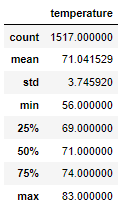
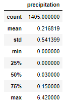

# surfs_up
Module 9

## Overview of Analysis
W. Avy would like more information on temperature trends before opening his store in Oahu.  He wants to to determine if the surf and ice cream shop is sustainable year round.  We are going to concentrate on June and December for client.

## Resources:

Data Source: 
- [hawaii.sqlite](hawaii.sqlite)

 
Software: Software: PostgreSQL v13.3, pgAdmin 4 v5.3, Jupyter Notebook, Anaconda 4.10.1, Python 3.7.6, Visual Studio Code, 1.56.0
 
Code: [SurfsUp_Challenge.ipynb](SurfsUp_Challenge.ipynb)

## Results: Temperature June vs December

- The difference between the minimum temperatures of June (64°F) and December (56°F) is a total of 8°F.
- The difference between the maximum temperatures of June (85°F) and December (83°F) is a total of 2°F.
- The difference between the average/mean temperatures of June (74.9°F) and December (71°F) is a total of 3.9°F.
- There is not a big swing in temperatures between June and December and should allow for the store to operate year round.

## Results: Percipitation June vs December

- The difference between the maximum amount of precipitation between June (4.43 inches) and December (6.42 inches) is a total of 1.99 inches.
- The difference between the average/mean of precipitation between June (0.13 inches) and December (0.22 inches) is a total of 0.9 inches.
- There is not a large difference in the amount of precipitation between the months of June and December and should allow for the store to operate year round.

## Results: Station Temperature and Precipitation

## Summary:

- There is not a large difference between the temperatures and precipitation levels between June and December to prevent the store from opening all year round.
- I have provided a chart of the weather stations in the area.  A location to avoid to set up the store would be Manoa Lyon Arbo (USC00519128) because it has the lowest average/mean yearly temperature and the highest average/mean amount of yearly precipitation. 
- To gain some of this information a couple of queries were created to show the precipitation levels of June and December to help inform W. Avy of his decision.
- Also, a couple of queries were created to sort out the average/mean tempertures and precipitation levels of all the locations we used to gather the information.
